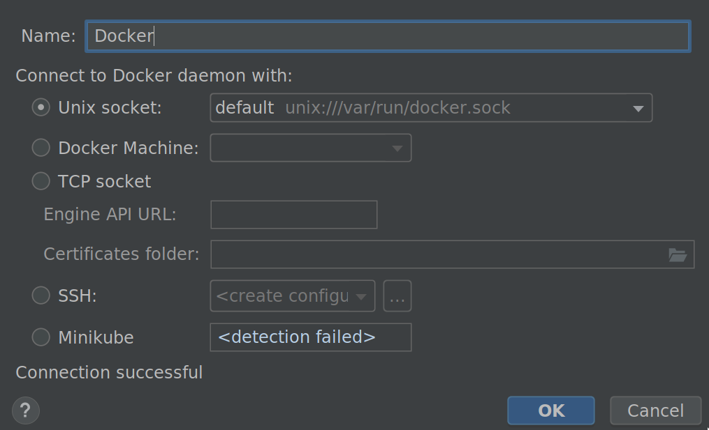
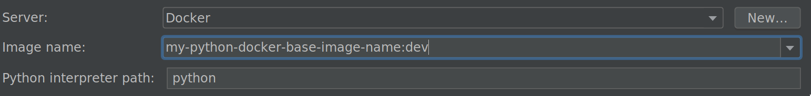
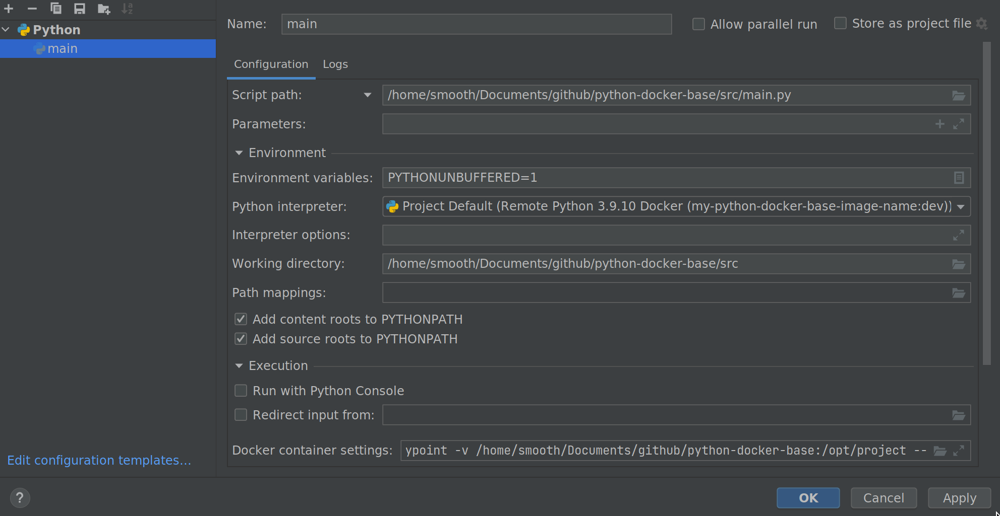
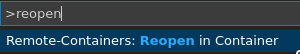

Docker is a containerization technology widely used when deploying our applications to production.

In this article we will discuss the pros and cons of using docker as our development environment and how to set up 
a development environment for our python projects with docker.
## Pros and cons of using docker in development
As any other technology, docker has its pros and cons. Here I'll show you the good and bad side I have seen of using docker for development.
### Pros of using docker
* Environment will be reproducible across all members of the team
* Some python packages use system libraries. Without docker we have to somehow tell the team to install them before running de project
* Development environment will be set up in 1 command
* Our development and production environments will be very similar, with will result in the reduction of possible problems when deploying our application to production (with docker).

### Cons of using docker
* Not a good option if we are developing a graphical user interface (GUI) project
* Developers have one more tool to learn if they don't already know, even though ones might love it
* Even though the overhead is less than with a virtual machine, there still is a tiny overhead. [IBM Research Report](https://dominoweb.draco.res.ibm.com/reports/rc25482.pdf)

## Python Docker project structure 
```
├── devops
│   ├── dev
│   │   ├── Dockerfile
│   │   ├── Dockerfile.dockerignore
│   │   └── requirements.txt
│   └── prod
│       ├── Dockerfile
│       ├── Dockerfile.dockerignore
│       └── requirements.txt
├── Makefile
└── src
    └── main.py
```

* Devops: contains development and production environments with its dockerfiles and requirements
* src: the source of our python code
* Makefile: to build and connect to the docker images of development and production in an easier way

### Development environment

#### Dockerfile
This will be the image to use in development. We'll create a non-root user, which will be convenient in case we want to write or modify file from inside the docker, and be able to update or delete them with our normal non-root user.

We'll only copy the requirements so our image will be smaller, and it's all we need for development
```dockerfile
FROM python:3.9-slim-bullseye

COPY devops/dev/requirements.txt /app/requirements.txt
ARG UNAME=user
ARG UID=1000
ARG GID=1000

RUN groupadd -g $GID -o $UNAME \
    && useradd -m -u $UID -g $GID -o -s /bin/bash $UNAME

USER $UNAME

RUN pip install --no-cache-dir -r /app/requirements.txt
ENV PATH=$PATH:/home/$UNAME/.local/bin

WORKDIR /app
```
#### Dockerfile.dockerignore
Limit docker context to the things that matter
```ignorelang
*
!/devops/dev/requirements.txt
```
#### requirements.txt
Contains all the requirements for developing our python app, might not be exactly the same in production.
In this case we'll include the code formatter 'black' only for development
```
black==22.8.0
```
### Makefile
We can use a makefile to make building and running images easier

```
DOCKER_IMAGE_NAME=my-python-docker-base-image-name
DEV_IMAGE_NAME=${DOCKER_IMAGE_NAME}:dev
PROD_IMAGE_NAME=${DOCKER_IMAGE_NAME}:0.0.1

# -------------------- Development -----------------------
dev/build:
	DOCKER_BUILDKIT=1 docker build \
		--build-arg USER_NAME=user \
		--build-arg USER_UID=$(shell id -u) \
		--build-arg USER_GID=$(shell id -g)  \
		-f devops/dev/Dockerfile \
		-t ${DEV_IMAGE_NAME} .


dev/shell:
	docker run -it --rm \
		-v $(shell pwd)/src:/app \
		--entrypoint /bin/bash \
		${DEV_IMAGE_NAME}

black:
	docker run -it --rm \
		-v $(shell pwd)/src:/app \
		${DEV_IMAGE_NAME} black /app

# -------------------- Production -----------------------
...
```
Targets:
* ```make dev/build``` : builds the development image

* ```make dev/shell``` : connects to the development image
* ```make black``` : formats our source code


### How to use the development image in Pycharm Professional

1. Build the development image in a terminal using ```make dev/build```
2. Open the project in Pycharm and go to

   ```File -> Settings -> Project -> Python interpreter -> ⚙ -> Add -> Docker```
   1. Configure docker

      
   
   2. Select your development image
   
      

3. Execute main using docker image
   

### How to use the development image in VSCode
As opposed to Pycharm, VSCode doesn't run one container per 'program' execution. Instead, VSCode 
launches one development container and then runs python commands from there.

Configuring VSCode for python execution is fairly more complex, specially if we want to
maintain a clean folder structure like the previously proposed, but it can be done like this:

1. Install VSCode Remote Containers extension
2. Configure file ```.devcontainer/devcontainer.json``` with the following contents.
   ```json5
   {
      "name": "Python 3",
      "image" :"my-python-docker-base-image-name:dev",  // YOUR IMAGE NAME
      "forwardPorts": [],
      "remoteUser": "user",
      "workspaceMount": "type=bind,src=${localWorkspaceFolder},dst=/app",
      "workspaceFolder": "/app",
   
      // Configure tool-specific properties.
      "customizations": {
          "vscode": {
              "extensions": [
                  "ms-python.python"
              ]
          }
      }
   }
   ```
3. Set up  ```.vscode/launch.json``` file with the following contents.
   ```json5
   {
       "configurations": [
           {
               "name": "Python: main.py",
               "type": "python",               
               "request": "launch",
               "program": "src/main.py",
               "console": "integratedTerminal",
               "justMyCode": true
           }
       ]
   }
   ```
4. Open folder in remove development environment using ```ctrl + shit + p``` and type ```reopen in container```
   
   

5. Now you are ready to go to run and debug your python project inside docker

Notice that if all the team is going to develop only in VSCode, there are better ways of configuring everything.

From my experience, pycharm professional is the easier and faster IDE to develop python apps in docker

In this article we didn't focused on how to mount volumes, expose ports, attach to networks or use a docker compose file.
